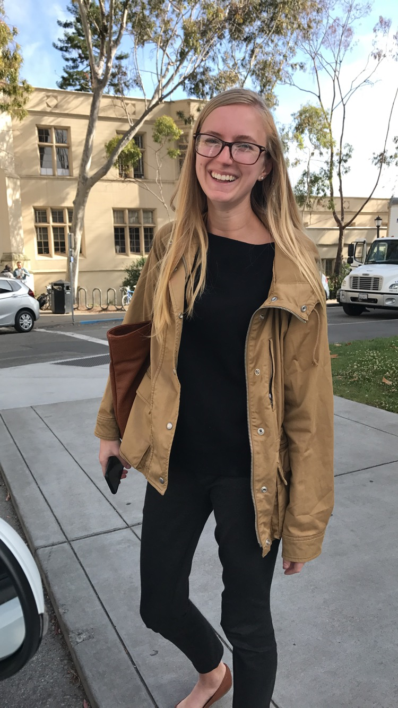

<link rel="stylesheet" href="papercss/dist/paper.css" type="text/css">

I am a Ph.D. candidate in political science at the University of California Berkeley. This fall, I will begin work as a postdoctoral researcher at Princeton University. 

My research interests combine political psychology and political economy to understand how people's contexts--social, informational, economic, and otherwise--equip them with the resources they need to participate in politics. 

I am particularly interested in processes of mutual influence between institutions and their citizens' knowledge, efficacy, and trust. Other ongoing work involves the role of place and social context in political attitudes and the development of survey experimental methods for addressing questions of interest to political science. 

My teaching interests center on quantitative methods, especially research design, causal inference, and computational techniques. 

Please contact me at e.mitchell.elder (at) princeton (dot) edu .